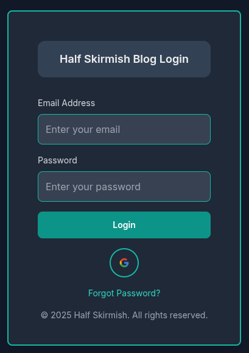

This is an Administration Dashboard prepared using Next.js for the purpose of adding blogs and pictures to my website easily.
For styling, I am using Tailwind CSS, Database MongoDB and Backend FastAPI

## Login Screen

  

